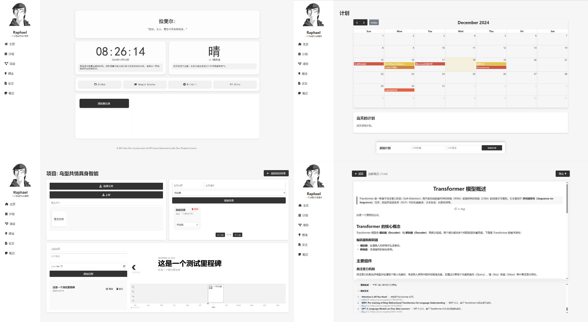
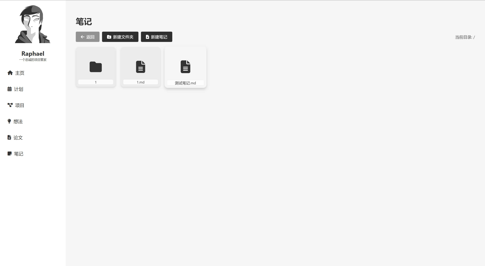
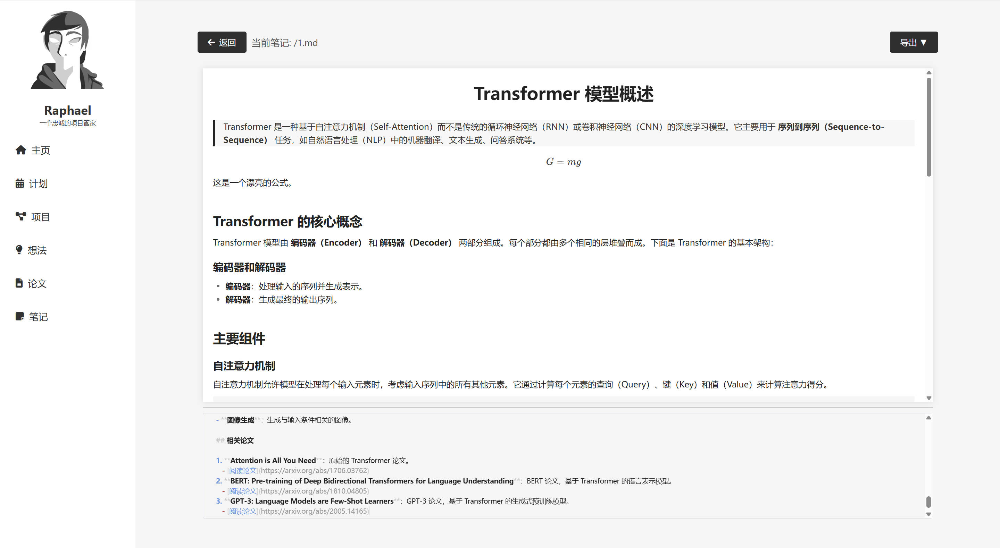

# Raphael - 您的私人研究助理

[English Version](README.md)



## 概述

**Raphael** 是一款全面的学术项目管理工具，旨在简化您的研究工作流程。无论您是在管理项目、组织想法、撰写论文还是记录详细笔记，Raphael 都提供了所有必要的功能，以提升您的生产力和效率。

## 功能

- **项目管理**：轻松创建、编辑和删除项目，有效组织您的研究工作。
- **计划管理**：制定详细的计划，规划您的研究目标和里程碑。
- **想法库**：在一个集中位置捕捉和组织您的研究想法。
- **论文管理**：无缝撰写、编辑和管理您的学术论文。
- **笔记记录**：保持全面的笔记，易于访问和搜索。
- **文件处理**：轻松上传、分类、搜索和管理与项目相关的文件。
- **任务管理**：创建、分配和跟踪任务，确保项目目标的及时完成。
- **里程碑跟踪**：通过互动时间线可视化项目进展，展示重要里程碑。
- **前端库**：
  - **FullCalendar**：用于交互式日历和调度功能。
  - **html2pdf**：将 HTML 内容转换为 PDF 文档。
  - **KaTeX**：美观地渲染数学公式。
  - **TimelineJS**：创建动态且视觉吸引力的时间线。
  - **Toast UI Editor**：提供 Markdown 编辑器，用于创建和编辑笔记。

## 优势

- **极致轻量化和小型化**：由于依赖浏览器网页渲染，整个软件的大小控制在了只有 **22MB**，确保在低配置的硬件上也能流畅运行。与之形成对比的是流行的论文管理软件**Zotero**，仅安装包就达到了**85MB**。
- **集成了大量功能**：将多个项目管理功能整合到一个统一的工具中。
- **性能开销低**：优化效率高，Raphael 以低性能开销运行，适用于各种硬件配置。
- **跨平台便利性**：设计无需依赖特定的 GUI 系统，确保在不同操作系统上无缝运行。
- **最小化依赖**：不依赖于繁重的外部 UI 系统，便于维护和部署。
- **简约美观的设计**：简洁直观的用户界面，提升用户体验，避免不必要的复杂性。

## 已知问题

- **CSS 管理**：由于这是我第一次编写大型前端项目，目前的 CSS 结构有些混乱。未来的更新将致力于改进和模块化 CSS 以提高可维护性。
- **功能增强**：虽然 Raphael 覆盖了广泛的项目管理需求，但基于用户反馈，总有机会添加更多功能。

欢迎贡献和改进。请随时 Fork 仓库并提交 Pull Request！

## 安装

### 前提条件

- **Python 3.7+**
- **pip**
- **Git**

### 步骤

1. **克隆仓库**

    ```bash
    git clone https://github.com/574118090/Raphael-Assistant.git
    cd Raphael
    ```

2. **安装依赖**

    ```bash
    pip install -r requirements.txt
    ```

3. **初始化数据库**

    ```bash
    python init_db.py
    ```

4. **运行应用**

    ```bash
    python run.py
    ```

5. **或者，下载发布版可执行文件**

    - 访问 [Releases](https://github.com/yourusername/Raphael/releases) 页面。
    - 下载最新的 `Raphael.exe`。
    - 运行可执行文件以启动 Raphael，无需设置 Python 环境。

6. **访问 Raphael**

    - **如果通过源码运行**：
        - 打开浏览器，访问 [http://127.0.0.1:21823](http://127.0.0.1:21823)。Raphael 将启动并显示在系统托盘中，使用托盘图标或是快捷键Alt+R访问应用。
    - **如果运行 `.exe` 文件**：
        - Raphael 将启动并显示在系统托盘中。使用托盘图标或是快捷键Alt+R访问应用。

## 打包应用

要使用 PyInstaller 创建独立的可执行文件（`.exe`），请按照以下步骤操作：

1. **确保已安装所有依赖**

    ```bash
    pip install -r requirements.txt
    ```

2. **使用提供的 Spec 文件运行 PyInstaller**

    ```bash
    pyinstaller run.spec
    ```

    - 这将生成一个 `dist` 文件夹，包含 `Raphael.exe` 可执行文件。

## 使用

### 创建项目

1. 点击 **创建项目** 按钮。
2. 填写项目详情，包括名称、简介、甲方和类型。
3. 提交表单以创建新项目。

### 管理项目

- **编辑**：点击项目卡片上的编辑图标以修改项目详情。
- **删除**：点击垃圾桶图标以删除项目。

### 系统托盘功能

- **访问 Raphael**：双击系统托盘中的 Raphael 图标以打开应用。
- **打开网页**：点击“打开网页”选项以在浏览器中打开 Raphael。
- **退出**：通过系统托盘关闭 Raphael。

### 导航功能

使用导航栏在计划、项目、想法、论文和笔记之间切换。

### 文件管理

- 在每个项目内上传和分类文件。
- 高效搜索和管理您的文件。

### 任务与里程碑管理

- 创建和跟踪与项目相关的任务。
- 使用互动时间线可视化项目进展。

## 技术栈

- **后端**:
  - **Flask**：轻量级的 WSGI Web 应用框架。
  - **SQLAlchemy**：用于数据库交互的 ORM。
- **前端**:
  - **FullCalendar**：用于交互式日历和调度。
  - **html2pdf**：将 HTML 内容转换为 PDF。
  - **KaTeX**：渲染数学表达式。
  - **TimelineJS**：创建动态时间线。
  - **Toast UI Editor**：提供 Markdown 编辑器，用于创建和编辑笔记。
- **其他库**:
  - **pystray**：系统托盘图标集成。
  - **PIL (Pillow)**：图像处理。
  - **pyinstaller**：打包 Python 应用。

## 截图

### 概述

### 项目仪表盘


*展示项目的项目仪表盘。*

### 计划日历


*用于管理计划的交互式日历。*

### 想法库


*集中管理想法的界面。*

### 论文管理


*管理学术论文的界面。*

### 笔记部分


*全面的笔记记录界面。*


*笔记编辑界面。*

## 贡献

欢迎贡献！请按照以下步骤操作：

1. **Fork 仓库**

2. **创建新分支**

    ```bash
    git checkout -b feature/YourFeature
    ```

3. **提交更改**

    ```bash
    git commit -m "添加 YourFeature"
    ```

4. **推送到分支**

    ```bash
    git push origin feature/YourFeature
    ```

5. **打开 Pull Request**

## 许可证

本项目基于 [MIT 许可证](LICENSE) 许可。

## 联系方式

如有任何疑问或需要支持，请联系 [chenlizheme@gmail.com](mailto:chenlizheme@gmail.com)。
