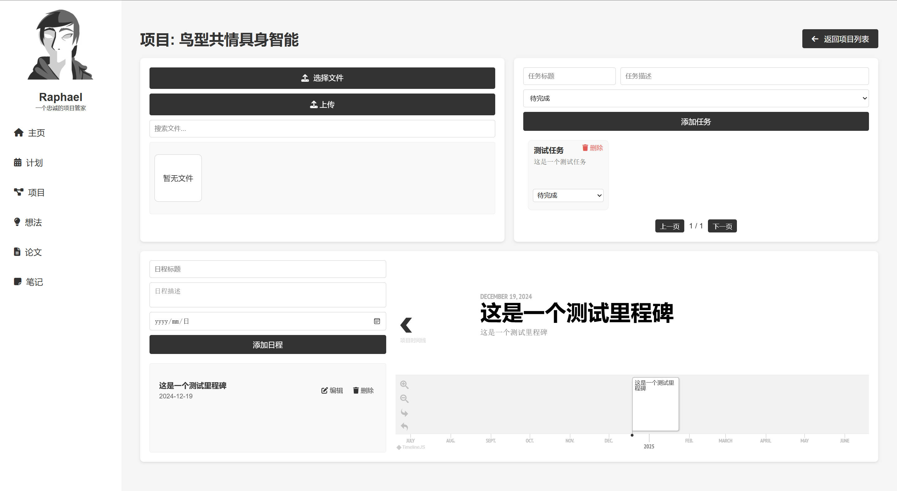
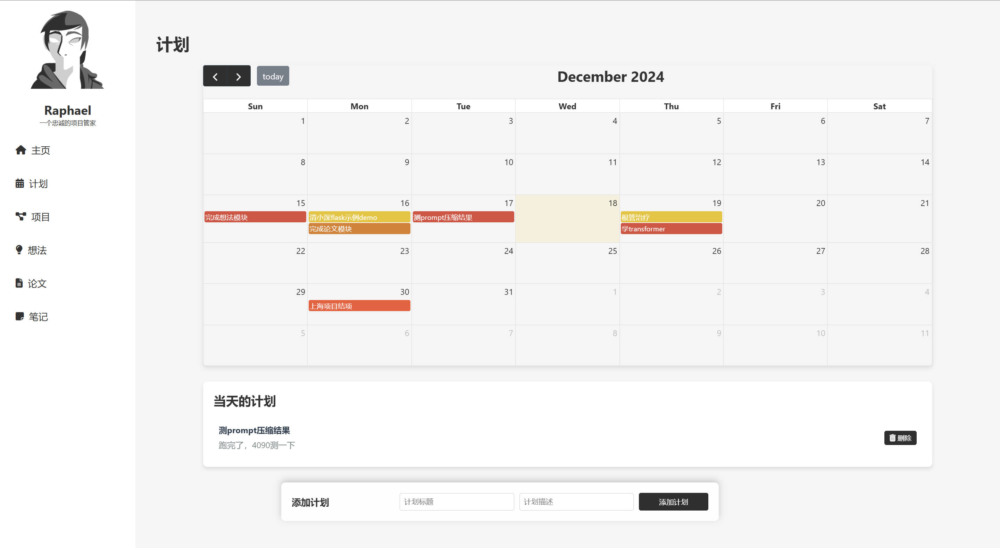
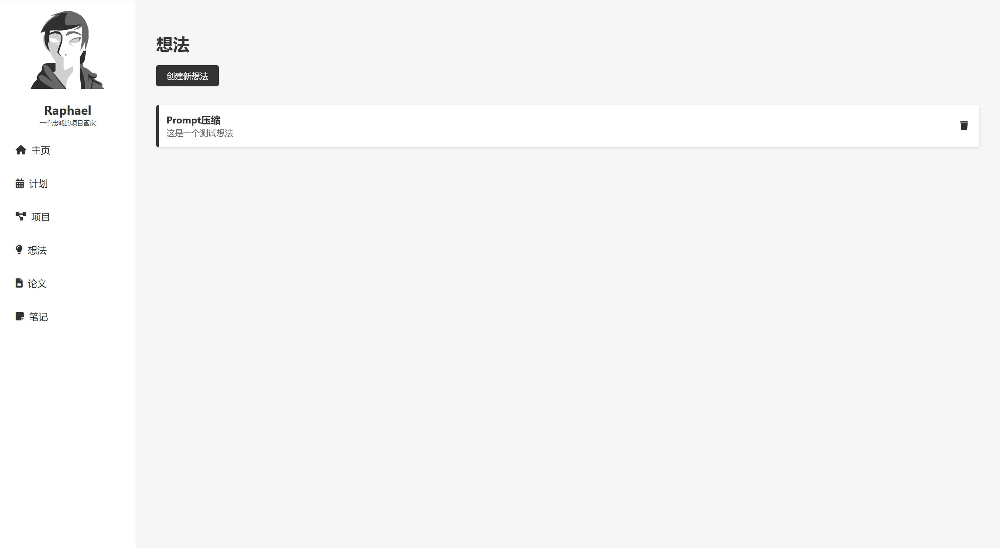
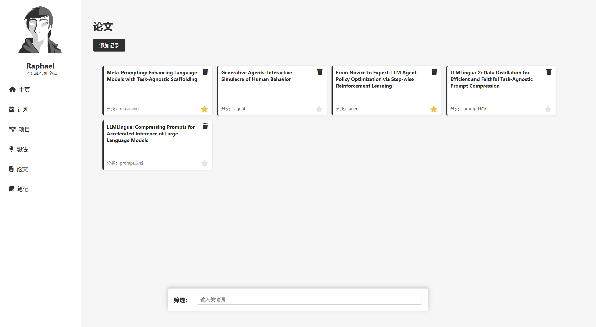

# Raphael - Your Personal Research Assistant

[中文版](README.zh.md)


## Overview

**Raphael** is a comprehensive academic project management tool designed to streamline your research workflow. Whether you are managing projects, organizing ideas, writing papers, or keeping detailed notes, Raphael provides all the essential features to enhance your productivity and efficiency.

## Features

- **Project Management**: Easily create, edit, and delete projects to organize your research effectively.
- **Plan Management**: Develop detailed plans, set research goals, and track milestones.
- **Idea Library**: Capture and organize your research ideas in a centralized location.
- **Paper Management**: Seamlessly write, edit, and manage your academic papers.
- **Note-Taking**: Keep comprehensive notes that are easy to access and search.
- **File Management**: Upload, categorize, search, and manage files related to your projects.
- **Task Management**: Create, assign, and track tasks to ensure timely completion of project goals.
- **Milestone Tracking**: Visualize project progress through an interactive timeline showcasing key milestones.
- **Frontend Libraries**:
  - **FullCalendar**: For interactive calendars and scheduling features.
  - **html2pdf**: Converts HTML content into PDF documents.
  - **KaTeX**: Beautifully renders mathematical formulas.
  - **TimelineJS**: Creates dynamic and visually appealing timelines.
  - **Toast UI Editor**: Provides a Markdown editor for creating and editing notes.

## Benefits

- **Extreme Lightweight and Small**: Thanks to browser-based rendering, the entire software is optimized to a file size of only **22MB**, ensuring smooth operation even on low-spec hardware. For comparison, the popular paper management software **Zotero** has an installer size of **85MB**.
- **Integrated with Many Features**: Combines multiple project management functions into one unified tool.
- **Low Performance Overhead**: Runs efficiently with minimal resource usage, suitable for various hardware configurations.
- **Cross-Platform Convenience**: Designed without dependence on a specific GUI system, ensuring seamless operation across different operating systems.
- **Minimal Dependencies**: No reliance on heavy external UI systems, making maintenance and deployment easier.
- **Simplified and Beautiful Design**: A clean and intuitive user interface to enhance user experience without unnecessary complexity.

## Known Issues

- **CSS Management**: Since this is my first time writing a large frontend project, the current CSS structure is somewhat messy. Future updates will focus on improving and modularizing the CSS for better maintainability.
- **Feature Enhancements**: While Raphael covers a broad range of project management needs, there is always room for more features based on user feedback.

Contributions and improvements are welcome. Feel free to fork the repository and submit a Pull Request!

## Installation

### Prerequisites

- **Python 3.7+**
- **pip**
- **Git**

### Steps

1. **Clone the Repository**

   ```bash
   git clone https://github.com/574118090/Raphael-Assistant.git
   cd Raphael
   ```

2. **Install Dependencies**

   ```bash
   pip install -r requirements.txt
   ```

3. **Initialize the Database**

   ```bash
   python init_db.py
   ```

4. **Run the Application**

   ```bash
   python run.py
   ```

5. **Alternatively, download the release executable**

   - Visit the [Releases](https://github.com/yourusername/Raphael/releases) page.
   - Download the latest `Raphael.exe`.
   - Run the executable to start Raphael without setting up a Python environment.

6. **Access Raphael**

   - **If running from source**:
     - Open a browser and visit [http://127.0.0.1:21823](http://127.0.0.1:21823). Raphael will launch and show up in the system tray. Access the app via the tray icon or the shortcut Alt+R.
   - **If running the `.exe` file**:
     - Raphael will launch and show up in the system tray. Access the app via the tray icon or the shortcut Alt+R.

## Packaging the Application

To create a standalone executable file (`.exe`) using PyInstaller, follow these steps:

1. **Make sure all dependencies are installed**

   ```bash
   pip install -r requirements.txt
   ```

2. **Run PyInstaller using the provided Spec file**

   ```bash
   pyinstaller run.spec
   ```

   - This will generate a `dist` folder containing the `Raphael.exe` executable file.

## Usage

### Creating a Project

1. Click the **Create Project** button.
2. Fill in project details including the name, description, client, and type.
3. Submit the form to create a new project.

### Managing Projects

- **Edit**: Click the edit icon on the project card to modify project details.
- **Delete**: Click the trash can icon to delete a project.

### System Tray Features

- **Access Raphael**: Double-click the Raphael icon in the system tray to open the app.
- **Open Webpage**: Click the "Open Webpage" option to open Raphael in your browser.
- **Exit**: Close Raphael via the system tray.

### Navigation Features

Use the navigation bar to switch between plans, projects, ideas, papers, and notes.

### File Management

- Upload and categorize files within each project.
- Efficiently search and manage your files.

### Task and Milestone Management

- Create and track tasks related to your projects.
- Visualize project progress using the interactive timeline.

## Tech Stack

- **Backend**:
  - **Flask**: A lightweight WSGI web application framework.
  - **SQLAlchemy**: ORM for database interaction.
- **Frontend**:
  - **FullCalendar**: For interactive calendar and scheduling features.
  - **html2pdf**: Converts HTML content into PDF documents.
  - **KaTeX**: Renders mathematical formulas.
  - **TimelineJS**: Creates dynamic timelines.
  - **Toast UI Editor**: Provides a Markdown editor for creating and editing notes.
- **Other Libraries**:
  - **pystray**: For system tray icon integration.
  - **PIL (Pillow)**: Image processing.
  - **pyinstaller**: For packaging Python applications.

## Screenshots

### Overview

### Project Dashboard


*Shows the project dashboard.*

### Plan Calendar


*Interactive calendar for managing plans.*

### Idea Library


*Interface for managing ideas in a centralized location.*

### Paper Management


*Interface for managing academic papers.*

### Notes Section


*Comprehensive note-taking interface.*


*Note editing interface.*

## Contributing

Contributions are welcome! Please follow these steps:

1. **Fork the repository**

2. **Create a new branch**

   ```bash
   git checkout -b feature/YourFeature
   ```

3. **Commit changes**

   ```bash
   git commit -m "Add YourFeature"
   ```

4. **Push to the branch**

   ```bash
   git push origin feature/YourFeature
   ```

5. **Open a Pull Request**

## License

This project is licensed under the [MIT License](LICENSE).

## Contact

If you have any questions or need support, please contact [chenlizheme@gmail.com](mailto:chenlizheme@gmail.com).